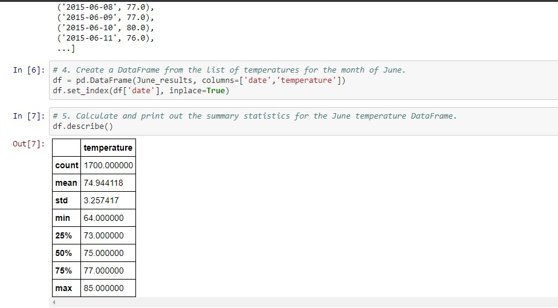
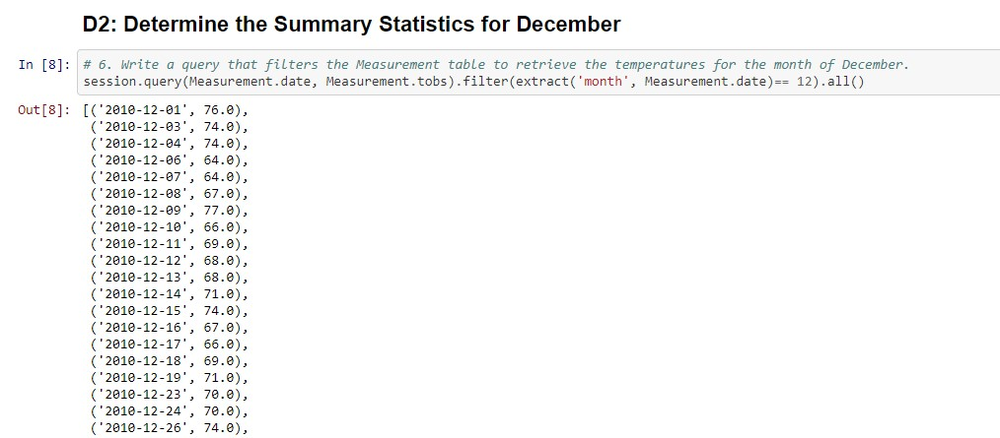
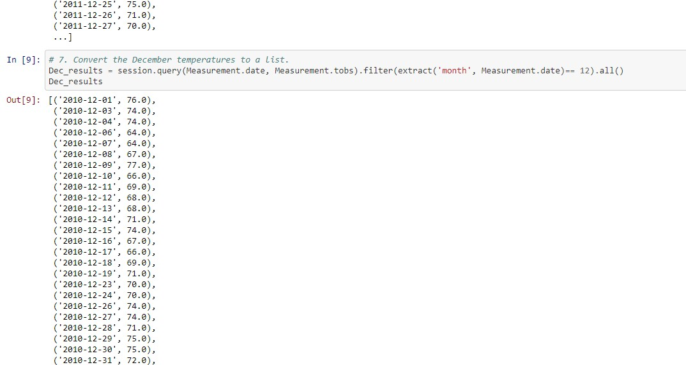
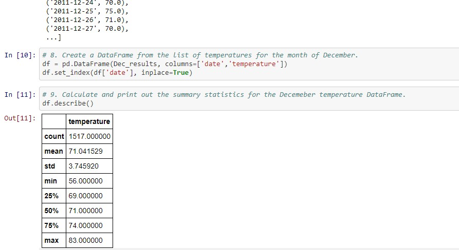

# surfs_up
Pandas, SQLite, VSCode, Flask, SQLAlchemy
## Overview

### W. Avy is the potential majority investor for the “Surf N Shake Shop” and is concerned about the amount of precipitation on Oahu, Hawaii. There needs to be enough rain to keep everything green, but not so much that you lose out on that ideal surfing and ice cream weather.  You know that you can set W. Avy's mind at ease by analyzing precipitation levels and showing him the cold, hard, data that backs up Oahu as the perfect place to surf. You have the last 12 months of precipitation data already loaded into your SQLite database, so you are ready to go.
### W. Avy states – “I know this code works, you know it works, but how will we show it to my board of directors? I doubt they even know what GitHub is, much less how to use it."  You pause to think. W. Avy has a point; the board of directors probably doesn't really care about the mechanics of the code you've written. They just want to be able to access the results. You respond, "I got this, W. Avy. Just leave it to me. I'll use Flask, which will let me display my results in a webpage. All you have to do is provide your board with the URL."
### We've learned how to set up and create a Flask application. Now it's time to create our routes so that W. Avy's board of directors can easily access our analysis. We're so close, so stay focused because this will be good stuff! Let's begin by creating a new Python file and importing dependencies our app requires.  W. Avy wants more information about temperature trends before opening the surf shop. Specifically, he wants temperature data for the months of June and December in Oahu, to determine if the surf and ice cream shop business is sustainable year-round.  This new assignment consists of two technical analysis deliverables and a written report. You will submit the following:
* Deliverable 1: Determine the Summary Statistics for June
* Deliverable 2: Determine the Summary Statistics for December
## Results
### Please see attached code and results of the deliverables below on the subsequent images.

### Listed below are the differences between June and December temperatures in Oahu:
* 1. There appears to be an increased variance of 15.3% from June to December which points to December weather being more unpredictable.
* 2. This variance increase in December leads to lower temperatures - predictably with the min temperature at 56 degrees, where the min temp in June is 64 degrees.
* 3. All statistics for mean, min, 25%, 50% and 75% show a significant lower temperature by 3-4 degrees - depending on the metric.
## Summary
